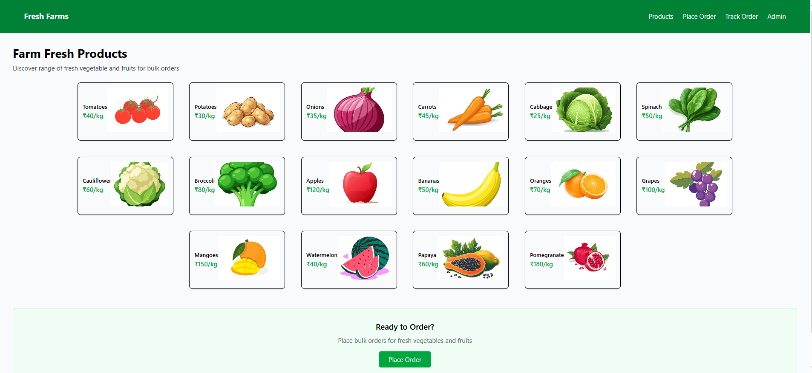

# 🥬 Farm Fresh – Bulk Vegetable/Fruit Ordering Platform (Backend)

## Overview

Farm Fresh is a simple bulk vegetable/fruit ordering platform built as part of an assignment.  
This repository contains the **backend implementation** using **Node.js, Express, and SQLite**.

The backend supports:

- Browsing products
- Placing bulk orders
- Tracking orders by Order ID
- Admin order management and status updates

> ⚠️ **Note:** Frontend development using React.js is currently **in progress**.

---

## Tech Stack

- **Backend:** Node.js, Express.js
- **Database:** SQLite
- **Other Tools:** sqlite, cors

---

## Features Implemented

### Buyer Features

- **Browse Products**
  - Fetch a list of vegetables/fruits with name, price, category, and image.
- **Place Order**
  - Buyer can place an order by providing:
    - Buyer name
    - Delivery address
    - Product(s) and quantity
  - Order is saved with:
    - Auto-generated Order ID
    - Default status: `Pending`
- **Track Order**
  - Buyer can track an order using Order ID
  - Displays:
    - Order details
    - Ordered items
    - Current order status

---

### Admin Features

- **View All Orders**
  - Admin can view all placed orders with:
    - Buyer name
    - Delivery address
    - Total amount
    - Order status
- **Update Order Status**
  - Admin can update order status:
    - `Pending → Delivered`
  - Updated status is reflected immediately in buyer order tracking

---

## Database Design

### Tables Used

- **products**
- **orders**
- **order_items**

### Orders Table Includes

- Buyer name
- Delivery address
- Total amount
- Order status
- Created timestamp

---

## API Endpoints

### Buyer APIs

- `GET /products` – Fetch product list
- `POST /orders` – Place an order
- `GET /orders/:orderId` – Track order by Order ID

### Admin APIs

- `GET /admin/orders` – View all orders
- `PUT /admin/orders/:orderId` – Update order status

---

## Backend Deployment link

- https://farm-fresh-b3ot.onrender.com

---

## Testing

All APIs were tested using:

- VS Code REST Client (`app.http`)
- Manual API requests

---

## Frontend Status

- Frontend development using **React.js** is currently **in progress**.
- Backend APIs are fully functional and ready for integration.

### Screenshot

### Deployed link

- https://farm-fresh-gules.vercel.app/

---

## 📌 Notes

- No authentication is implemented (as per assignment instructions).
- Admin access is provided via separate API routes.

---

## ✅ Assignment Status

- Backend: **Completed**
- Frontend: **In Progress**
- Database Schema: **Completed**
- Core Functionality: **Working as expected**
